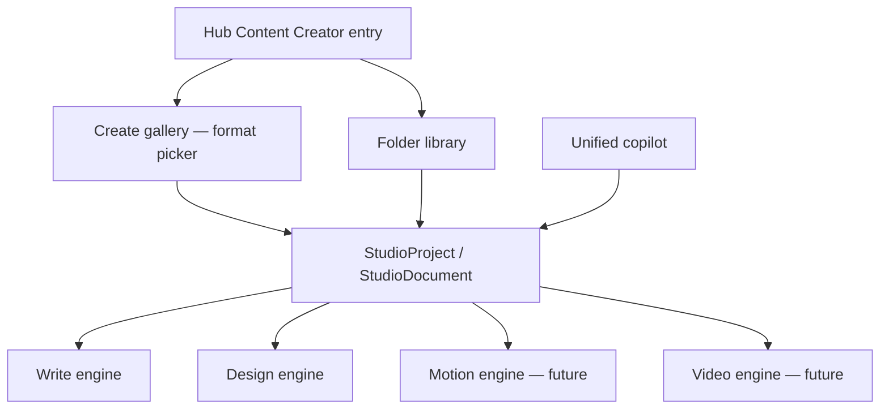

# Etholys Content Creator Studio — visão de produto (F9+)

**Estado:** planeamento — **não implementar** até Redação (`write`) e Desenho (`design`) estarem impecáveis (F8 concluído).

**Relação com Studio actual:** o Studio de hoje é o **núcleo** (documento + canvas + IA). O Content Creator Studio é a **evolução do produto no Hub** — mesma marca, entrada repensada, vários modos de criação.

---

## 1. Objetivo

Ser a plataforma de criação de conteúdo da Etholys — no espírito **Canva + Gamma + Google Docs/Word**, num só ecossistema:

| Tipo | Referência | Estado actual |
|------|------------|---------------|
| **Texto / documentos** | Word, Google Docs, Notion | ✅ modo `write` — copilot, export, tabelas |
| **Design gráfico** | Canva, Gamma slides | ✅ modo `design` — layout %, IA imagem, apresentações |
| **Animação** | Canva Animate, Lottie | ⬜ storyboard + cenas parciais; falta timeline/export motion |
| **Vídeo** | CapCut web, Canva Video | ⬜ timeline MVP; falta edição multi-track, export MP4 |
| **Social / formatos fixos** | Canva templates | ⬜ galeria parcial (redes, print) |
| **Web / email** | Beefree, Stripo | ⬜ roadmap |

**Princípio:** um **projeto** pode misturar camadas (texto + slides + vídeo) como hoje `write` + `design` no mesmo `canvasState`, evoluindo o modelo em vez de silos.

---

## 2. Repensar a entrada no Hub

Hoje: cartão **Etholys Studio** → biblioteca de pastas → documento.

**Alvo (F9):**

```
Hub → Content Creator Studio
        ├─ Criar (galeria unificada — não só «documento»)
        │    ├─ Documento / relatório (write)
        │    ├─ Apresentação / deck (design)
        │    ├─ Post / story (formato fixo)
        │    ├─ Vídeo curto (timeline)
        │    └─ Animação / motion
        ├─ Biblioteca (pastas — igual hoje)
        └─ Brand kit + templates empresa
```

- O botão laranja / hot button pode passar a **«Criar»** com modal tipo Canva (grid de formatos), não só lista de ficheiros.
- Nome comercial possível: **Etholys Studio** mantém-se; subtítulo **Content Creator** na UI.

---

## 3. Pré-requisitos (ordem)

1. ✅ Copilot co-edição (P1–P5, T1–T4)
2. 🔄 **F8** — shell IDE (barra fina, chat colapsável, ferramentas à direita, documento ao centro)
3. **Redação impecável** — paginação estável, ribbon completo, estilos, tabelas Excel, export fiel
4. **Desenho impecável** — drag/resize, camadas, brand kit, IA layout, apresentador
5. **F9.1** — Hub + galeria «Criar» unificada
6. **F9.2+** — motion, vídeo export, formatos sociais dedicados

---

## 4. Arquitectura (alto nível)



- **Não** criar apps separadas por tipo — estender `studioMode` / `format` / blocos (`mediaMeta`, timeline).
- APIs e `canvasState` versionados; migrações additive.

---

## 5. O que NÃO fazer agora

- Rebrand total do Hub antes de F8
- App separada «Vídeo» ou «Animação» ao lado de Studio
- CRDT (F7) bloqueante para F9 — pode paralelizar depois do shell

---

## 6. Ligações

- [etholys-studio.md](./etholys-studio.md) — implementação actual
- [etholys-tools.md](./etholys-tools.md) — posição no ecossistema

Última actualização: **agosto 2026**
