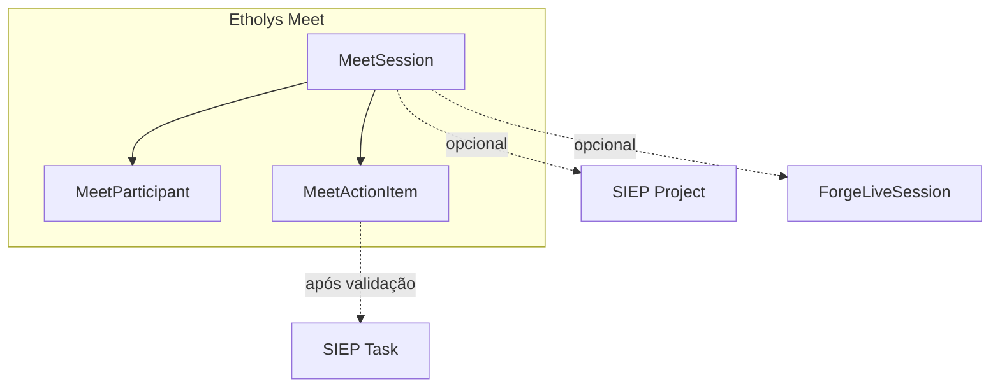

# Etholys Meet — motor de reuniões (transversal)

**Versão:** 0.1  
**Data:** 2026-07-20  
**Status:** F0–F5 parcial em código; infra Jitsi self-hosted e gravação pendentes  
**Público:** product, desenvolvedores, agentes de IA  

**Fonte de verdade** para videoconferência, breakouts, convites, gravação, transcrição e pós-reunião com IA no Etholys.  
**Entrada para agentes:** [AGENTS.md](../../AGENTS.md) → este ficheiro.

---

## 1. Princípio

> **Um motor, vários espelhos.** Não existem Zooms separados por módulo.

A sala técnica (Jitsi + metadados + IA) é única. FORGE, SIEP, Hub/ferramentas soltas e (depois) NEXUS são **superfícies** que abrem a mesma reunião com contexto diferente.

| Espelho | Entrada | Contexto | Extra |
|---------|---------|----------|--------|
| **Hub / ferramentas** | `/hub/meet` | Solta ou depois vinculada | Entrada genérica |
| **FORGE** | Salão / sessão live (já existe) | Curso, coorte, `ForgeLiveSession` | Breakouts, presença, capacitação |
| **SIEP** | Reuniões do projeto | `projectId` / atividade | Resumo → tarefas em rascunho |
| **NEXUS** | AT / rodadas (futuro) | Rede / empreendedor | Ações comerciais |

**Regra:** o que já funciona no FORGE (Jitsi no salão) **não some**. Passa a consumir o motor Meet por baixo (`mirror=forge`).

---

## 2. Capacidades (roadmap)

| Fase | Entrega | Notas |
|------|---------|--------|
| **F0** | Spec + modelos + Hub stub | ✅ |
| **F1** | Sala Jitsi + convite e-mail + `.ics` + breakouts (host UI) | ✅ API `/api/meet/sessions` + Hub criar/entrar |
| **F2** | Espelho Hub + vínculo SIEP + espelho FORGE live | ✅ Meet auto em live sessions; projeto no Hub |
| **F3** | Pós-reunião: notas/transcrição → Claude resumo | ✅ `POST .../finalize` — gravação Jibri→R2 depois |
| **F4** | Tarefas pré-criadas + validação → Task SIEP | ✅ accept/reject/convert |
| **F5** | Alertas leves *durante* a call | ✅ parcial: sala integrada `/hub/meet/[id]` + `POST .../briefing` |
| **F6** | OAuth Google / Outlook Calendar | Depois do `.ics` |

### Breakouts

Requisito **cedo** (F1): capacitações online já geram reclamação sem salas. O motor deve expor breakout via Jitsi self-hosted (não `meet.jit.si`).

### Infra

- App Etholys (Next.js) + Postgres: metadados, convites, resumos, tarefas  
- **Jitsi** no Contabo (piloto): `meet.etholys.com` — ver [MEET-JITSI-CONTABO.md](../MEET-JITSI-CONTABO.md)  
- **Jitsi (+ Jibri se gravação)** em VPS **separado** (RAM) — alvo médio prazo  
- **R2** para gravações / áudio  
- **Claude (Anthropic)** para transcrição-resumo e JSON de action items  

Piloto: mesmo Contabo da app (parar Jitsi quando não houver calls). Produção com gravação: VPS dedicado.

---

## 3. Modelo conceptual



- **`MeetSession`:** título, horário, room Jitsi, status, mirror, vínculos  
- **`MeetActionItem`:** rascunho de tarefa / próximo passo (validação humana)  
- **`ForgeLiveSession`:** continua a existir; pode referenciar ou ser espelhada por um `MeetSession`

---

## 4. Código (onde implementar)

```
apps/web/
  app/hub/meet/                 # espelho Hub (criar sala, lista, .ics)
  app/hub/meet/[sessionId]/     # sala integrada (Jitsi embed + painel IA)
  app/api/meet/sessions/        # GET/POST listar e criar
  app/api/meet/sessions/[id]/   # GET/PATCH
  app/api/meet/sessions/[id]/ics/
  app/api/meet/sessions/[id]/invite/
  lib/meet/                     # tipos, room, ICS, create-session, e-mail
  prisma/schema.prisma          # MeetSession, MeetParticipant, MeetActionItem
  prisma/migrations/manual_etholys_meet.sql
```

Jitsi legado FORGE: `lib/forge/jitsi-config.ts`, `lib/forge/delivery.ts` — evoluir para delegar room URL ao `lib/meet/` sem partir o salão.

---

## 5. Relação com CARTA / Advisor

- **Meet** = comunicação síncrona + memória da reunião  
- **CARTA** = aprovações / governança  
- **Advisor** = alertas transversais (pode notificar “há tarefas de reunião por validar”)

Não fundir os três produtos.

---

## 6. Critérios de sucesso (piloto capacitação)

1. Facilitador abre sessão FORGE com breakouts estáveis  
2. Convite por e-mail + ficheiro calendário (ICS)  
3. Participantes entram pelo link do curso **ou** pelo Hub Meet  
4. (Fase seguinte) Encerra → resumo + lista de ações editável  

Última atualização: **julho 2026**.
