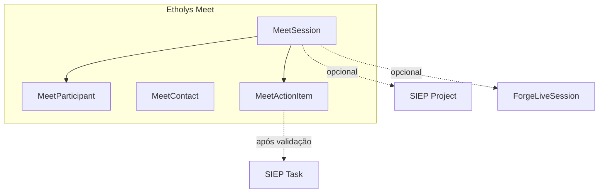

# Etholys CHORUS — produto de reuniões (transversal)

**Versão:** 0.4  
**Data:** 2026-10-06  
**Status:** F0–F8 em código; produto **CHORUS** (rotas `/hub/meet` mantidas)  
**Público:** product, desenvolvedores, agentes de IA

**Nome de produto:** **CHORUS** (não “Meet” — evita confusão com Google Meet).  
**Fonte de verdade** para videoconferência, breakouts, convites, gravação, transcrição e pós-reunião com IA no Etholys.  
**Entrada para agentes:** [AGENTS.md](../../AGENTS.md) → este ficheiro.

### Regra de linguagem (obrigatória)

CHORUS é um **produto Etholys**, não um wrapper com nome de motor open-source.  
Na UI, copy, seeds, e-mails e respostas a humanos: só **CHORUS**, sala, gravação, transcrição, recap.  
Detalhe de infra (contentores, STT de sala, VPS) vive só em [docs/MEET-JITSI-CONTABO.md](../MEET-JITSI-CONTABO.md) / [docs/MEET-VPS-JIBRI.md](../MEET-VPS-JIBRI.md) — **ops**, não produto.

### Transcrição e pós-reunião

| Camada | O quê | Notas |
|--------|--------|--------|
| Ao vivo | STT na sala CHORUS | Rápida; diarização limitada |
| **Camada A (sempre)** | Whisper/Gemini STT + diálogo clássico (nomes, minutagem, limpeza) + **recap estruturado** | Entrega profissional **sem LLM**. Não cola citações STT |
| **Camada B (silenciosa)** | Anthropic **ou** Gemini (`meet-llm.ts` / `GEMINI_API_KEY`) | Polish + resumo/tarefas ricos; falha → fica A. Utilizador **não** vê “IA” |

Upload / Transcribir → `POST /api/meet/sessions/[id]/transcribe` (A + B opcional no mesmo fluxo).
Gate: `canUseMeetAiEnhancement()` → `hasMeetLlmAvailable()`.

---

## 1. Princípio

> **Um produto, vários espelhos.** Não existem Zooms separados por módulo.

A sala CHORUS (vídeo + metadados + IA) é única. FORGE, SIEP, Hub/**Etholys Tools** e NEXUS são **superfícies** que abrem a mesma reunião com contexto diferente.
Ver [etholys-tools.md](./etholys-tools.md) para a faixa de ferramentas.

| Espelho | Entrada | Contexto | Extra |
|---------|---------|----------|--------|
| **Hub / Etholys Tools** | `/hub/meet` | Solta ou depois vinculada | Entrada genérica |
| **FORGE** | Salão / sessão live | Curso, coorte, `ForgeLiveSession` | Breakouts, presença, capacitação |
| **SIEP** | Reuniões do projeto | `projectId` / atividade | Resumo → tarefas em rascunho |
| **NEXUS** | Hub NEXUS rail / `POST /api/meet/nexus` | Rede / AT / empreendedor | `mirror=nexus` |

**Regra:** o salão FORGE continua a usar a **sala CHORUS** (`mirror=forge`) — plataforma `chorus` (alias legado `jitsi` na config).

---

## 2. Capacidades (roadmap)

| Fase | Entrega | Notas |
|------|---------|--------|
| **F0** | Spec + modelos + Hub stub | ✅ |
| **F1** | Sala CHORUS + convite e-mail + `.ics` + breakouts (host UI) | ✅ contactos CHORUS (guardar + autocomplete) |
| **F2** | Espelho Hub + vínculo SIEP + espelho FORGE live | ✅ |
| **F3** | Pós-reunião IA + gravação | ✅ resumo/tarefas; **gravação local** no browser → ficheiro no PC/disco do utilizador (sem nuvem Etholys) |
| **F4** | Tarefas pré-criadas + validação → Task SIEP | ✅ |
| **F5** | Transcrição real + atribuição por participante | ✅ Vosk ES + painel Hub; arranque automático ao entrar |
| **F6** | Agenda dia/semana/mês/ano + OAuth Google / Outlook | ✅ API + UI; ligação persistente em `Account`; requer `GOOGLE_CALENDAR_ENABLED=1` / Azure AD |
| **F7** | Salas permanentes + recorrência (diária/semanal/dias úteis/mensal) | ✅ materializa ocorrências; mesmo link da série; apagar esta / seguintes / série |
| **F8** | Captura externa (Zoom/Teams) | ✅ `/hub/meet/capture` + shell Electron `apps/meet-capture` |

### Breakouts

Requisito **cedo** (F1): capacitações online. Breakouts na sala CHORUS self-hosted (`meet.etholys.com`).

### Infra (ops — não usar estes nomes na UI)

- App Etholys (Next.js) + Postgres: metadados, convites, resumos, tarefas  
- Motor de vídeo em `meet.etholys.com` — [MEET-JITSI-CONTABO.md](../MEET-JITSI-CONTABO.md)  
- Gravação em VPS + webhook — [MEET-VPS-JIBRI.md](../MEET-VPS-JIBRI.md)  
- **R2/S3** para gravações (`AWS_*` / `R2_*`)  
- STT ao vivo na sala + **Whisper** pós-reunião (`OPENAI_API_KEY`)  
- LLM para resumo / action items / briefing

---

## 3. Modelo conceptual


```mermaid
flowchart TB
  subgraph motor [Etholys Meet]
    Session[MeetSession]
    Part[MeetParticipant]
    Contact[MeetContact]
    Action[MeetActionItem]
  end

  Session --> Part
  Session --> Action
  Session -.->|opcional| Project[SIEP Project]
  Session -.->|opcional| Live[ForgeLiveSession]
  Action -.->|após validação| Task[SIEP Task]
```

---

## 4. Código (onde implementar)

```
apps/web/
  app/hub/meet/                 # espelho Hub
  app/hub/meet/[sessionId]/     # sala + transcrição ao vivo + gravação
  app/api/meet/sessions/        # CRUD, ics, invite, finalize, briefing
  app/api/meet/contacts/        # agenda de convites (guardar + autocomplete)
  app/api/meet/sessions/[id]/recording/
  app/api/meet/sessions/[id]/transcribe/
  app/api/meet/sessions/[id]/transcript/
  app/api/meet/sessions/[id]/calendar/
  app/api/meet/calendar/connections/ # estado OAuth persistente do utilizador
  app/api/meet/webhooks/jibri/
  app/api/meet/nexus/           # espelho NEXUS
  lib/meet/                     # room, ICS, bridges, R2, STT, calendário
  prisma/schema.prisma          # MeetSession, MeetParticipant, MeetTranscriptSegment, MeetActionItem
```

---

## 5. Relação com CARTA / Advisor

- **Meet** = comunicação síncrona + memória da reunião  
- **CARTA** = aprovações / governança  
- **Advisor** = alerta `meet_actions_pending` quando há rascunhos por validar (+ notificação ao host no finalize)

Não fundir os três produtos.

---

## 5b. Visual in-call (estilo Google Meet)

| Camada | O quê | Limite |
|--------|--------|--------|
| **Chrome Etholys** (`MeetRoomClient`) | Top bar (hora + título + info), contagem de participantes, painel de transcrição, fundo `#202124`, iframe com cantos arredondados | Não controla ícones/tiles *dentro* do iframe |
| **Embed da sala** (`MeetConferenceFrame`) | Branding CHORUS/Etholys, filmstrip vertical, toolbar ordenada, fundo charcoal | Depende da versão do motor de vídeo |
| **Servidor vídeo** (`infra/jitsi/*` + `apply-jitsi-branding.sh`) | CSS/config de branding na sala | Ops: patches somem se o contentor web for recriado sem rerun do script |

Deploy branding só do motor de vídeo (sem rebuild app): `bash scripts/apply-jitsi-branding.sh` no Contabo.

---

## 6. Critérios de sucesso (piloto capacitação)

1. Facilitador abre sessão FORGE com breakouts estáveis na sala CHORUS
2. Convite por e-mail com Google/Outlook + `.ics`; convidados do evento recebem RSVP do provedor
3. Participantes entram pelo curso **ou** Hub CHORUS
4. Encerra → gravação / upload → STT opcional → resumo + ações editáveis

Última atualização: **outubro 2026**.
