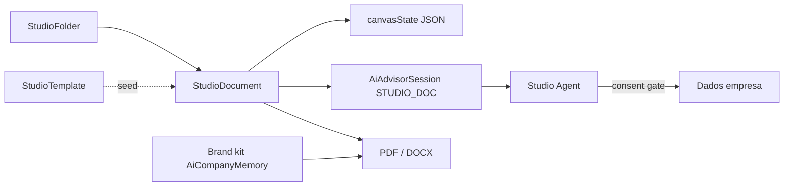

# Etholys Studio — criação de documentos (ferramenta transversal)

**Fase atual (UI):** duas camadas na galeria e no editor — **Conteúdo** (Word/Excel/PPT guión/PDF, modo `write`) e **Desenho** (Canva/Gamma/InDesign, modo `design`, inclui Fotos e Vídeos como composição visual). Caminho incremental para paridade Word/Gamma.

**Fonte de verdade** para o estúdio de documentos com IA no Etholys.  
**Entrada para agentes:** [AGENTS.md](../../AGENTS.md) → este ficheiro.

---

## 1. Princípio

> **Ferramenta avulsa, atalho em todo o lado.** Não é SIEP, ATLAS nem Core básico.  
> Pertence à faixa **[Etholys Tools](./etholys-tools.md)** (Studio ≠ guarda-chuva das outras ferramentas).

| Camada | Papel |
|--------|--------|
| **Core Docs** (`/documents`) | Repositório de ficheiros S3 — permanece incluído |
| **Studio** (`/hub/studio`) | Addon/ferramenta: pastas, templates, canvas + chat IA |
| **Sistemas** | Continuam fluxos específicos (informe SIEP, proposta FUNDHUB); Studio é o motor geral |

- Cartão no Hub na secção **Etholys Tools** (junto a Meet / CARTA / Advisor)  
- **Botão hot** flutuante em ecrãs autenticados → atalho para `/hub/studio`  
- Licença: isento como Meet/CARTA no MVP (produto addon; gate comercial depois)

---

## 2. Capacidades (roadmap)

| Fase | Entrega | Notas |
|------|---------|--------|
| **F0** | Spec + pastas + docs + templates seed + editor dual-pane + agente consent | ✅ |
| **F1** | Kit de marca da empresa + export PDF/DOCX | ✅ |
| **F2** | Diagramas editáveis + “ajusta o diagrama” no chat | ✅ Mermaid + quadro visual Excalidraw |
| **F2.4** | Âmbito IA por secção + anti-wipe | ✅ seleção de blocos (mira) + filtro servidor |
| **F2.5** | Estilo de bloco (align / escala / moldura) | ✅ na faixa de design com secções selecionadas |
| **F2.1** | Permissões / partilha pasta+doc (membros + email externo; papéis viewer/editor/admin) | ✅ |
| **F2.2** | Contexto IA: ficheiros na pasta + anexos no chat | ✅ |
| **F2.3** | Editor: chat esquerdo redimensionável, undo/versões, folhas A4/A3, moldes | ✅ |
| **F3** | Pontes “Abrir no Studio” desde SIEP/FUNDHUB/Meet | ✅ one-shot via `POST /api/studio/import` |
| **F3.1** | Rastreabilidade: quem/quando falou com IA e editou o doc | ✅ `StudioDocumentActivity` + painel |
| **F4** | Templates por domínio + colaboração/comentários | ✅ filtros SIEP/FUNDHUB/Meet/… + `StudioDocumentComment` |
| **F5** | Presença colaborativa + aviso de edição remota | ✅ heartbeat Postgres + avatars + reload |
| **F6** | Sync suave + auto-save + gestão de blocos | ✅ pull remoto se limpo; autosave 8s; mover/apagar |
| **F6.1** | Camadas Conteúdo/Desenho + ferramentas por camada | ✅ galeria dual; tabelas Excel; ribbon Word; toolbar Canva |
| **F7** | OT / CRDT (Yjs) para edição simultânea no mesmo bloco | Seguinte (infra colaboração) |
| **F8** | **Layout IDE tipo Cursor** — barra fina + laterais minimizáveis | 📋 Pipeline (após copilot P1–P5) |

### Copilot / co-edição (2026-08 — concluído antes de F8)

| # | Entrega | Estado |
|---|---------|--------|
| T1 | Mensagens nativas multi-turn (`chatMessages[]`) | ✅ |
| T2–T3 | Modos + botões + estado de sessão (aprovar/aplicar/migrar) | ✅ |
| T4 | Migração de conteúdo para estrutura aprovada | ✅ |
| P1 | UI modos + barra de acções de estrutura | ✅ |
| P2 | Selecção visual (página/bloco + mira) | ✅ |
| P3 | Canvas sync (preview, scroll, highlight pós-patch) | ✅ |
| P4 | Polish chat (Esc, Ctrl+Enter, anexos compactos, status) | ✅ |
| P5 | Migração heurística (docs grandes) | ✅ |

**F8 não substitui nem adianta este trabalho** — reorganiza só a shell do editor quando a co-edição estiver estável.

---

## 2.1 F8 — Layout IDE (referência: Cursor)

**Objectivo:** sensação de IDE / Canvas profissional — documento no centro, ferramentas nas margens, chrome mínimo.

```
┌─────────────────────────────────────────────────────────────────────────┐
│  barra fina (32px): voltar · título · guardar · export · partilhar · ⋮  │
├──────┬──────────────────────────────────────────────────────────┬──────┤
│ ◀    │                                                          │    ▶ │
│ chat │              CANVAS — só páginas / folhas                │ tool │
│ IA   │              (scroll, filmstrip opcional em baixo)       │ bar  │
│      │                                                          │      │
│ [≡]  │                                                          │ [≡]  │
└──────┴──────────────────────────────────────────────────────────┴──────┘
     ↑ minimizado = faixa estreita (~40px) com ícone para expandir
```

### Barra superior fina (comandos globais do documento)

Consolidar acções **transversais** que hoje estão espalhadas no header alto:

| Grupo | Acções (já existem ou a acrescentar) |
|-------|--------------------------------------|
| **Ficheiro** | Guardar, histórico/versões, **duplicar**, **mover para pasta**, **apagar documento**, voltar à biblioteca |
| **Exportar** | PDF, DOCX, PPTX, XLSX (submenu ou popover) |
| **Partilha** | Partilhar, comentários, presença |
| **Página** | Tamanho (A4/A3/Slide), orientação, margens, numeração |
| **Conta / doc** | Título inline, estado auto-save, último editor |
| **Mais (⋮)** | Plantilla, ligações Etholys, contexto de pasta, apresentador (slides) |

Estilo: **uma linha**, ícones + labels curtos ou só ícones com tooltip; sem ribbon duplicado no topo.

### Barra lateral esquerda — Chat IA (minimizável)

- Composer **único integrado** (estilo Cursor): dropdown de modo + atalhos rápidos + textarea + ícones na mesma caixa.
- Sem hero «IA de redacción», sem faixa «Conteúdo rápido» separada — atalhos dentro do menu do modo.
- **Minimizado:** faixa vertical com ícone `MessageSquare`; clique expande.

### Barra lateral direita — Edição (minimizável)

Mover para cá ferramentas que **não** são do documento em si:

| Modo write | Modo design |
|------------|-------------|
| Ribbon Word (tipo, negrito, listas, alinhamento) | Toolbar Canva (camadas, alinhar, cores) |
| Inserir tabela / imagem | IA desenho / media |
| Estilo de bloco seleccionado | Storyboard / cenas |
| Atalhos de secção (Ctrl+Enter nova secção) | Moldes de página |

**Minimizado:** faixa com ícone `PenTool` / `Layout`; expandir mostra o painel completo.
O centro **nunca** mostra ribbon flutuante sobre o canvas — só o documento.

### Zona central — apenas documento

- Canvas full-height entre as duas barras.
- Filmstrip de páginas: barra inferior **dentro** do canvas (estilo Word), não no header.
- Selecção IA (mira), highlight pós-patch e scroll-spy mantêm-se no canvas.

### APIs / componentes (implementação futura)

| Peça nova | Notas |
|-----------|--------|
| `StudioEditorShell.tsx` | Layout 3 colunas + top bar; estado `leftOpen`, `rightOpen`, widths |
| `StudioTopCommandBar.tsx` | Extrair do `page.tsx`; acciones ficheiro + export + partilha |
| `StudioRightToolPanel.tsx` | Ribbon write + toolbar design condicional |
| `POST …/duplicate` | Duplicar `StudioDocument` (+ sessão IA opcional nova) |
| Apagar | Já pode existir — expor na top bar com confirmação |

### Biblioteca (`/hub/studio`)

- **Sem hero marketing** — breadcrumb + grelha de pastas/docs; barra superior fina (Hub / Studio + acções).
- «Em branco» só na galeria Criar (não duplicar no header).
- Alinhado com F8: chrome mínimo, conteúdo primeiro.

### Ordem de implementação sugerida (F8)

1. **Shell + barras minimizáveis** (sem mudar lógica de edição)
2. **Top bar fina** + mover acções existentes
3. **Painel direito** — extrair ribbon/toolbar do canvas
4. **Duplicar / apagar / mover** na top bar
5. Polish visual (tokens Cursor-like: cinzas, bordas subtis, ícones 16px)

**Pré-requisito:** F7 ou aceitar que F8 é só UX shell (pode ir em paralelo com F7 se necessário, mas **depois** do copilot P1–P5).

---

## 3. Modelo



- **Visibilidade:** `private` por omissão (dono + convidados explícitos). `company` é **opt-in manual** no diálogo de partilha — nunca automático, nem para conteúdo legado. Itens sem dono (conta apagada) ficam acessíveis a ADMIN da empresa para não ficarem órfãos.
- **Papéis de partilha** (`StudioShare.role`, TEXT — sem migração de coluna):

| Papel | Código | Pode |
|-------|--------|------|
| **Dono** | `owner` (criador; não é share) | Tudo, incluindo apagar o item e mudar visibilidade |
| **Admin de conteúdo** | `admin` | Ler, criar/editar pastas e docs, exportar, copilot, **partilhar**, **alterar papéis**, revogar acessos, renomear; apagar docs na pasta |
| **Editor** | `editor` | Ler, criar/editar pastas e docs, exportar, copilot |
| **Visualizador** | `viewer` | Só ler / exportar |

  Default ao convidar: **`editor`**. Herança: partilha numa pasta ancestral aplica o mesmo papel aos filhos. Valores novos são aditivos (`viewer`/`editor` existentes mantêm-se).
- **`StudioFolder`:** árvore por `companyId`  
- **`StudioDocument`:** título, format, `canvasState` (páginas/blocos), `aiSessionId`  
- **`StudioTemplate`:** sistema (`isSystem`) ou por empresa  
- **`StudioContextAsset`:** ficheiros de contexto para a IA — `scope=folder` (gerais da pasta, herdam para docs filhos) ou `scope=document` (anexos do chat/doc). Texto extraído (PDF/DOCX/txt) injectado no prompt; imagens/PDF também como multimodal no turno. **Não** passam pelo gate de consentimento do catálogo Etholys (o utilizador carregou-os de propósito).
- **`StudioDocumentVersion`:** snapshots restauráveis (quem + quando)  
- **`StudioDocumentActivity`:** trilha unificada — `ai_prompt` / `ai_response` / `ai_edit` / `saved` / `restored` / `created` / `imported` / `comment` (ator + timestamp + resumo). API `GET /api/studio/documents/[id]/activity`. Campo `updatedById` no documento = último editor.  
- **`StudioDocumentComment`:** comentários no documento ou num bloco (`blockId`); resolver/reabrir; API `/api/studio/documents/[id]/comments`.  
- **`StudioDocumentPresence`:** quem está a ver/editar (heartbeat ~12s, TTL 45s). API `/api/studio/documents/[id]/presence`. Sync suave: se o doc local não está dirty, aplica a versão remota; senão mostra banner. Auto-guardar silencioso aos 8s (`quiet` + sem snapshot).  
- **Templates por domínio:** `domain` em `STUDIO_SYSTEM_TEMPLATES` (general/siep/fundhub/meet/forge/atlas/nexus) — filtro na biblioteca.  
- **Galeria Criar (estilo Canva):** modal com **duas camadas** (Conteúdo / Desenho), sidebar por tipo, pré-visualização antes de criar, **tamanho livre** (Desenho) + **subir** PDF/DOCX/TXT (Conteúdo). Templates com `studioLayer` explícito; Design usa posições % visíveis.  
- **Plantillas da empresa:** `StudioTemplate` (`isSystem=false`); no editor **«Plantilla»** grava o `canvasState` actual; reaparecem em Criar → «As nossas».  
- **IA — um copiloto, herança de contexto (não árvore de agentes):** o mesmo agente Studio; contexto herda pasta → documento (`StudioContextAsset` + brand + links). Novas páginas (manual ou via IA de diagramação) devem seguir o padrão de layout das páginas do template activo — sem UI de “multi-agentes”.  
- **`EtholysDocumentLink`:** vínculo persistente Studio/Core → sistema+entidade (NEXUS AT, SIEP, FUNDHUB, empresa…). A IA usa os vínculos sem consentimento de catálogo. API `/api/document-links`.  
- **Brand kit:** `AiCompanyMemory` category `studio_brand` + fallback `Company.logo` / `Company.color`

Distinto do modelo `Document` (blob S3).

---

## 4. Agente Studio

- Kind de sessão: `STUDIO_DOC`  
- Conhece o **catálogo** do ecossistema (o que existe), mas **não injeta dados** sem consentimento explícito no turno  
- Resposta estruturada: mensagem + `canvasPatches` e/ou `consentRequest`  
- UI: se `consentRequest`, mostrar fontes e botões Sim/Não; só depois reenvia com `approvedSources`
- **Âmbito:** o utilizador pode selecionar blocos (mira) → `targetBlockIds` no copiloto; o servidor **filtra** patches fora do âmbito e **bloqueia** reescritas do documento inteiro

---

## 5. Export (F1)

| Formato | Mecanismo |
|--------|-----------|
| **PDF** | `studioCanvasToHtml` + Abacus `createConvertHtmlToPdfRequest` |
| **DOCX** | OOXML mínimo via JSZip (`studioCanvasToDocxBuffer`) |

API: `POST /api/studio/documents/[id]/export` com `{ format: "pdf" | "docx" }`.

---

## 6. Código

| Área | Path |
|------|------|
| UI Hub | `apps/web/app/hub/studio/` |
| Galeria Criar | `apps/web/components/studio/StudioCreateGallery.tsx` |
| Hot button | `apps/web/components/studio/StudioHotButton.tsx` |
| APIs | `apps/web/app/api/studio/` (incl. `templates`, `documents/from-file`) |
| Lib | `apps/web/lib/studio/` |
| Import F3 | `apps/web/lib/studio/import-from.ts`, `POST /api/studio/import` |
| Prisma | `StudioFolder`, `StudioDocument`, `StudioTemplate`, `StudioContextAsset` |
| SQL manual | `apps/web/prisma/migrations/manual_etholys_studio.sql` |
| Deploy | `scripts/apply-studio-deploy.sh` |

**Não reutilizar** Lab ANVIL (interno). O padrão de chat↔canvas inspira-se no informe SIEP, sem acoplar ao ciclo de vida de projetos.

### Deploy seguro (sem perda de dados)

A migração é **só additive** (`CREATE TABLE IF NOT EXISTS`, enum `ADD VALUE IF NOT EXISTS`). No servidor:

```bash
bash /opt/etholys/scripts/apply-studio-deploy.sh
```
