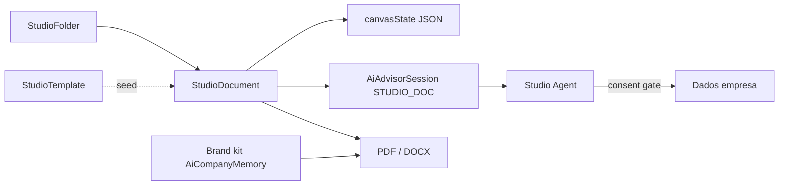

# Etholys Studio — criação de documentos (ferramenta transversal)

**Versão:** 0.4  
**Data:** 2026-08-07  
**Status:** F0–F2.2 em código (biblioteca, editor, consent, marca, export, Mermaid, papéis, contexto IA pasta/chat)  
**Público:** product, desenvolvedores, agentes de IA  

**Fonte de verdade** para o estúdio de documentos com IA no Etholys.  
**Entrada para agentes:** [AGENTS.md](../../AGENTS.md) → este ficheiro.

---

## 1. Princípio

> **Ferramenta avulsa, atalho em todo o lado.** Não é SIEP, ATLAS nem Core básico.  
> Pertence à faixa **[Etholys Tools](./etholys-tools.md)** (Studio ≠ guarda-chuva das outras ferramentas).

| Camada | Papel |
|--------|--------|
| **Core Docs** (`/documents`) | Repositório de ficheiros S3 — permanece incluído |
| **Studio** (`/hub/studio`) | Addon/ferramenta: pastas, templates, canvas + chat IA |
| **Sistemas** | Continuam fluxos específicos (informe SIEP, proposta FUNDHUB); Studio é o motor geral |

- Cartão no Hub na secção **Etholys Tools** (junto a Meet / CARTA / Advisor)  
- **Botão hot** flutuante em ecrãs autenticados → atalho para `/hub/studio`  
- Licença: isento como Meet/CARTA no MVP (produto addon; gate comercial depois)

---

## 2. Capacidades (roadmap)

| Fase | Entrega | Notas |
|------|---------|--------|
| **F0** | Spec + pastas + docs + templates seed + editor dual-pane + agente consent | ✅ |
| **F1** | Kit de marca da empresa + export PDF/DOCX | ✅ |
| **F2** | Diagramas editáveis + “ajusta o diagrama” no chat | ✅ preview Mermaid + patches via agente |
| **F2.1** | Permissões / partilha pasta+doc (membros + email externo; papéis viewer/editor/admin) | ✅ |
| **F2.2** | Contexto IA: ficheiros na pasta + anexos no chat | ✅ |
| **F2.3** | Editor: chat esquerdo redimensionável, undo/versões, folhas A4/A3, moldes | ✅ |
| **F3** | Pontes “Abrir no Studio” desde SIEP/FUNDHUB/Meet | Seguinte |
| **F4** | Templates por domínio + colaboração/comentários | |

---

## 3. Modelo



- **Visibilidade:** `private` por omissão (dono + convidados explícitos). `company` é **opt-in manual** no diálogo de partilha — nunca automático, nem para conteúdo legado. Itens sem dono (conta apagada) ficam acessíveis a ADMIN da empresa para não ficarem órfãos.
- **Papéis de partilha** (`StudioShare.role`, TEXT — sem migração de coluna):

| Papel | Código | Pode |
|-------|--------|------|
| **Dono** | `owner` (criador; não é share) | Tudo, incluindo apagar o item e mudar visibilidade |
| **Admin de conteúdo** | `admin` | Ler, criar/editar pastas e docs, exportar, copilot, **partilhar**, **alterar papéis**, revogar acessos, renomear; apagar docs na pasta |
| **Editor** | `editor` | Ler, criar/editar pastas e docs, exportar, copilot |
| **Visualizador** | `viewer` | Só ler / exportar |

  Default ao convidar: **`editor`**. Herança: partilha numa pasta ancestral aplica o mesmo papel aos filhos. Valores novos são aditivos (`viewer`/`editor` existentes mantêm-se).
- **`StudioFolder`:** árvore por `companyId`  
- **`StudioDocument`:** título, format, `canvasState` (páginas/blocos), `aiSessionId`  
- **`StudioTemplate`:** sistema (`isSystem`) ou por empresa  
- **`StudioContextAsset`:** ficheiros de contexto para a IA — `scope=folder` (gerais da pasta, herdam para docs filhos) ou `scope=document` (anexos do chat/doc). Texto extraído (PDF/DOCX/txt) injectado no prompt; imagens/PDF também como multimodal no turno. **Não** passam pelo gate de consentimento do catálogo Etholys (o utilizador carregou-os de propósito).
- **Brand kit:** `AiCompanyMemory` category `studio_brand` + fallback `Company.logo` / `Company.color`

Distinto do modelo `Document` (blob S3).

---

## 4. Agente Studio

- Kind de sessão: `STUDIO_DOC`  
- Conhece o **catálogo** do ecossistema (o que existe), mas **não injeta dados** sem consentimento explícito no turno  
- Resposta estruturada: mensagem + `canvasPatches` e/ou `consentRequest`  
- UI: se `consentRequest`, mostrar fontes e botões Sim/Não; só depois reenvia com `approvedSources`

---

## 5. Export (F1)

| Formato | Mecanismo |
|--------|-----------|
| **PDF** | `studioCanvasToHtml` + Abacus `createConvertHtmlToPdfRequest` |
| **DOCX** | OOXML mínimo via JSZip (`studioCanvasToDocxBuffer`) |

API: `POST /api/studio/documents/[id]/export` com `{ format: "pdf" | "docx" }`.

---

## 6. Código

| Área | Path |
|------|------|
| UI Hub | `apps/web/app/hub/studio/` |
| Hot button | `apps/web/components/studio/StudioHotButton.tsx` |
| APIs | `apps/web/app/api/studio/` |
| Lib | `apps/web/lib/studio/` |
| Prisma | `StudioFolder`, `StudioDocument`, `StudioTemplate`, `StudioContextAsset` |
| SQL manual | `apps/web/prisma/migrations/manual_etholys_studio.sql` |
| Deploy | `scripts/apply-studio-deploy.sh` |

**Não reutilizar** Lab ANVIL (interno). O padrão de chat↔canvas inspira-se no informe SIEP, sem acoplar ao ciclo de vida de projetos.

### Deploy seguro (sem perda de dados)

A migração é **só additive** (`CREATE TABLE IF NOT EXISTS`, enum `ADD VALUE IF NOT EXISTS`). No servidor:

```bash
bash /opt/etholys/scripts/apply-studio-deploy.sh
```
