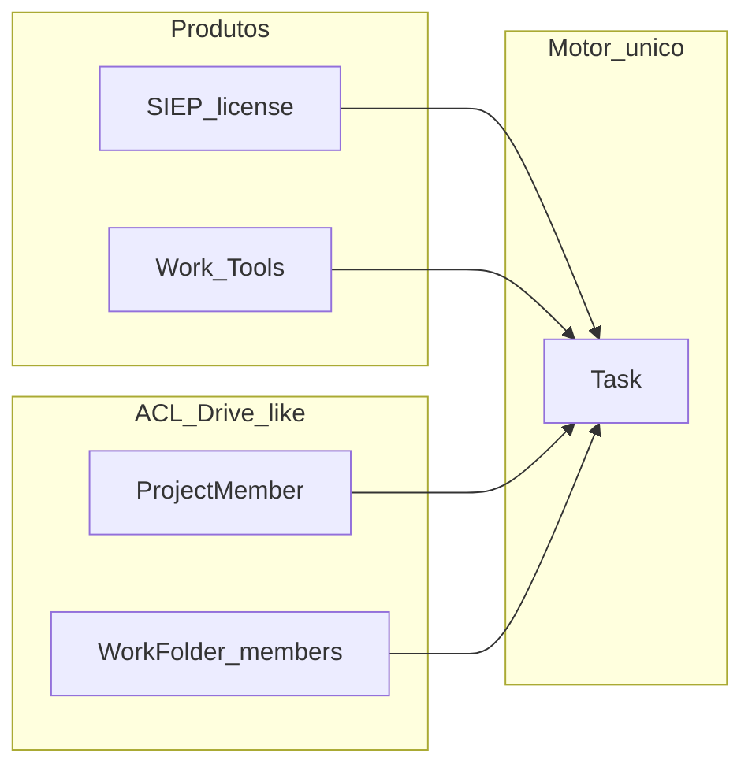

# Etholys Work — motor de tarefas (Etholys Tools)

**Versão:** 0.3  
**Data:** 2026-08-23  
**Status:** F0–F10 em código (vistas + pastas Drive-like); F11 Integrated Hub planeado  
**Público:** product, desenvolvedores, agentes de IA  

**Fonte de verdade** para o motor único de tarefas da equipa.  
**Entrada:** [AGENTS.md](../../AGENTS.md) → [etholys-tools.md](./etholys-tools.md) → este ficheiro.

---

## 1. Princípio

> **Um motor `Task`, vários espelhos.** Não duplicar Kanban SIEP vs “tarefas internas”.

| Superfície | Entrada | Filtro | Papel |
|------------|---------|--------|-------|
| **Work (Tools)** | `/hub/work` + atalho flutuante cyan | `companyId` ± `projectId` / pasta / assignee | Inbox e ops da equipa |
| **ATLAS** | `/tasks` | idem | Espelho ERP |
| **SIEP** | Secção atividades do projeto | `projectId` obrigatório | Execução do projeto |
| **Hub workspace** | `/hub/workspace` | Tarefas abertas | Espelho rápido |
| **Meet** | Pós-reunião → convert | Cria `Task` | Rascunho → tarefa |

**Regra:** `projectId` preenchido = tarefa de projeto (espelho SIEP). Sem `projectId` = tarefa operacional (empresa / área / pasta).

**Etholys Tools:** Work é membro da faixa Tools — não vive “escondido” só no ERP. ATLAS continua a ter atalho; a casa conceptual é Tools.

---

## 1.1 Dois produtos, um motor (Integrated Workspace)

SIEP (sistema licenciado) e Work (Tools) **permanecem produtos distintos** comercialmente. Partilham o motor `Task`.

| Modo | Experiência |
|------|-------------|
| **Separado** | Cliente só SIEP (atividades no projeto) ou só Work (ops / pastas) |
| **Integrado** | Mesma empresa usa Work + SIEP; sidebar Work lista projetos SIEP; tarefas de projeto aparecem nos dois sítios |

**F11 (planeado):** entry Hub unificada / setting “Integrated Workspace” — ainda não obrigatório; ACL e vistas já preparam o terreno.

Relatórios de campo / quilometragem / informes doador → **SIEP-only** (não Work).

---

## 2. O que NÃO é Work

| Peça | Onde |
|------|------|
| Aprovação formal de entrega | **CARTA** (Tools) — Work só dispara / liga |
| Mural da empresa (links, senhas, docs) | Ferramenta futura **Board** (Tools) — fora deste motor |
| Relatório de campo / quilometragem | SIEP (`TaskActivityReport`, …) |

---

## 3. Roadmap

| Fase | Entrega | Estado |
|------|---------|--------|
| **F0** | GET detalhe da tarefa; tags UI; subtarefas; comentários fiáveis; time log via detalhe | ✅ Base (ago/2026) |
| **F1** | Grupos/secções tipo Monday (`TaskGroup` + ordem); filtro por grupo | ✅ Base (ago/2026) |
| **F2** | Entrada Hub `/hub/work` + cartão Etholys Tools + hot button; deep-links ATLAS | ✅ (ago/2026) |
| **F3** | @menções em comentários → notificação | ✅ (ago/2026) |
| **F4** | Solicitar aprovação → CARTA inbox + notificação ao aprovador | ✅ (ago/2026) |
| **F5** | Templates de projeto (além de packs de tarefas) | Pendente |
| **F6** | Organizador: sidebar Setor/Projeto, dashboard de carga, vista Timeline/Gantt | ✅ Base (ago/2026) |
| **F7** | Espelho admin no Work (`/hub/work/settings`): setores, secções, atalhos SIEP/admin | ✅ Base (ago/2026) |
| **F8** | Pastas pessoais / de equipa (`WorkFolder`) — qualquer membro cria e gere as suas | ✅ (ago/2026) |
| **F9** | Vistas: Board, List, Kanban, Calendar, Timeline, Workload; URL `?nav=&view=`; My tasks | ✅ (ago/2026) |
| **F10** | ACL pastas tipo Drive: privado por defeito; invite + roles `viewer`/`editor`; `assertTaskAccess` | ✅ (ago/2026) |
| **F10b** | Bulk multi-select; schedule fields (start/estimate); calendar drag due; checklist delete/%; assign notify | ✅ (ago/2026) |
| **F11** | Integrated Hub (entry unificada SIEP↔Work; setting empresa) | Planeado |

---

## 4. Modelo (já partilhado)

`Task` em `prisma/schema.prisma`: `projectId?`, `companyId?`, `folderId?`, `assigneeId`, `parentId` (subtarefas), `tags`, `status`, `priority`, dates, recurring, checklist, comments, timeEntries, dependencies.

### Pastas (`WorkFolder`) — ACL Drive-like

| Regra | Comportamento |
|-------|----------------|
| Visibilidade | `PERSONAL` ou `SHARED` (rótulo); **acesso = owner ∪ `WorkFolderMember`** |
| Breaking change F10 | `SHARED` **já não** é company-wide; owners devem convidar |
| Roles | `viewer` (legado `member`), `editor`, `owner` |
| Leitura de tarefas | GET lista oculta tarefas em pastas sem acesso |
| Escrita | Assign a pasta exige `editor+` |

Lib: `apps/web/lib/work/folder-access.ts` (espelho leve de Studio share, sem magic links nesta fase).

---

## 5. Código

| Área | Path |
|------|------|
| UI ATLAS | `apps/web/app/(dashboard)/tasks/page.tsx` → `TasksBoard` |
| UI Hub Work | `apps/web/app/hub/work/page.tsx` → `WorkShell` |
| Settings Work | `apps/web/app/hub/work/settings/page.tsx` |
| Shell / vistas | `WorkShell`, `WorkSidebar`, `WorkDashboard`, `WorkGantt`, `WorkCalendar`, `WorkList`, `WorkWorkload` |
| Partilha pasta | `WorkFolderShareDialog` |
| Hot button | `apps/web/components/work/WorkHotButton.tsx` |
| Board partilhado | `apps/web/components/work/TasksBoard.tsx` |
| Templates | `apps/web/app/(dashboard)/templates/page.tsx` |
| APIs | `apps/web/app/api/tasks/`, `task-groups/`, `work-folders/`, `task-approvals/`, … |
| ACL | `apps/web/lib/work/folder-access.ts` |
| SQL | `manual_etholys_work_groups.sql`, `manual_etholys_work_approvals.sql`, `manual_etholys_work_folders.sql` |
| CARTA inbox | `apps/web/app/hub/carta/page.tsx` |
| Mentions | `apps/web/lib/work/mentions.ts` |

**URL Work:** `/hub/work?nav=all|mine|company|folder|project|department|dashboard&id=…&view=table|list|kanban|calendar|gantt|workload`

---

## 6. Relação com ATLAS §1.7

A arquitectura v2 lista “Tareas Internas” sob ATLAS. **Produto:** o domínio continua a ser o mesmo `Task`; o **posicionamento UX** migra gradualmente para Etholys Tools (Work), com ATLAS a manter espelho/atalho para equipas financeiras e ERP.
