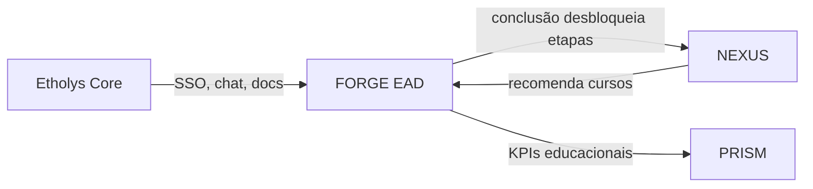
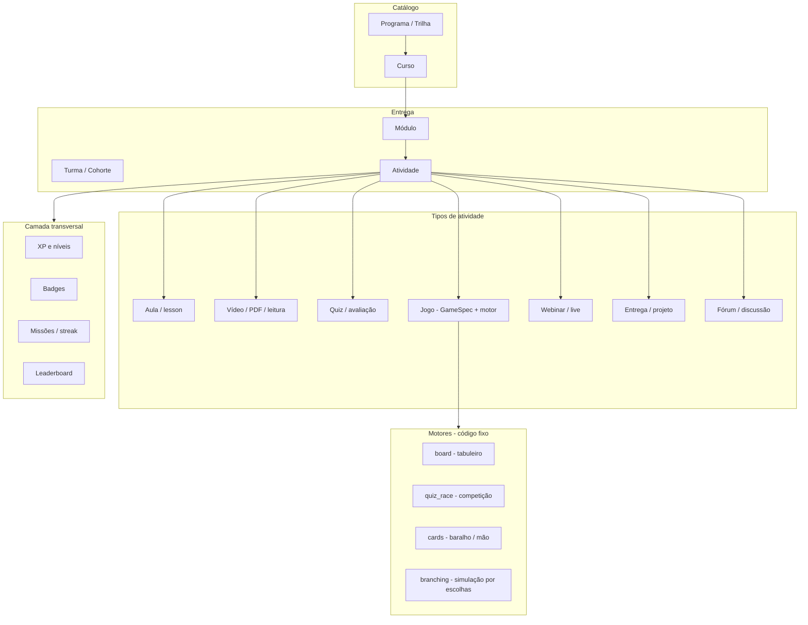
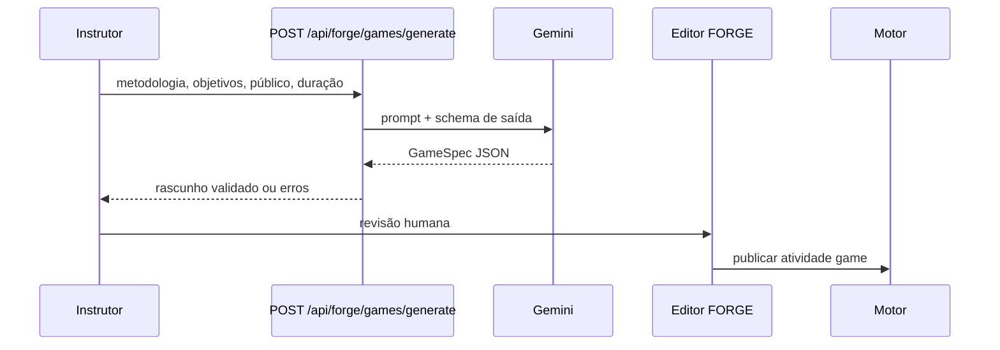

# FORGE — Arquitetura EAD unificada (cursos + jogos + gamificação)

**Versão:** 1.0  
**Data:** 2026-05-22  
**Status:** MVP F1–F5 em implementação (mai/2026)  
**Público:** desenvolvedores, product, agentes de IA  

**Fonte de verdade** para tudo relacionado com FORGE no repositório Etholys.  
**Entrada para agentes:** [AGENTS.md](../../AGENTS.md) → este ficheiro.

---

## 1. Princípio central

> **Uma plataforma, um percurso de aprendizagem, uma camada de gamificação — apenas a dinâmica da atividade é modular.**

**UI:** a interface deve funcionar para cursos **só e-learning**, **só jogos** ou **híbrido** — ver [forge-ui-vision.md](./forge-ui-vision.md).  
**Curso de referência (QA):** *La Expedición Sostenible* (`lib/forge/seed-expedicion-sostenible.ts`).

Cursos tradicionais (vídeo, leitura, quiz, entrega) e experiências lúdicas (tabuleiro, cartas, simulação) **não são produtos separados**. São **tipos de atividade** dentro do mesmo curso/trilha, com o mesmo progresso, turma, certificado e ranking.

A IA **não gera aplicações ad hoc** por pedido. Gera **`GameSpec`** (JSON versionado e validado) que **motores fixos** no código interpretam e renderizam — CMS de jogos educacionais.

---

## 2. Posição no ecossistema Etholys

| Aspecto | Detalhe |
|---------|---------|
| **Sistema** | FORGE — Ambiente educacional e de conexões |
| **Rota Hub** | `/hub/forge` |
| **Chave de licença** | `FORGE` em `Company.enabledSystems` / workspace |
| **Código atual** | Mockup UI: `apps/web/app/hub/forge/page.tsx`; ledger MVP: `apps/web/app/api/company-memory/forge-ledger/route.ts` |
| **LLM** | Gemini (`apps/web/lib/gemini-client.ts`) — mesmo padrão que NEXUS para geração estruturada JSON |

### Integrações previstas



- **NEXUS → FORGE:** diagnóstico/jornada recomenda cursos do catálogo.
- **FORGE → NEXUS:** conclusão de trilha desbloqueia ferramentas na jornada do empreendedor.
- **FORGE → PRISM:** taxa de conclusão, engajamento em jogos, certificados emitidos.

---

## 3. Modelo conceptual (espinha dorsal)



### Hierarquia pedagógica

| Entidade | Descrição |
|----------|-----------|
| **Program** | Agrupa vários cursos (ex.: “Inovação 2026”, certificação institucional) |
| **Course** | Container com objetivos, público-alvo, duração estimada, imagem, status (rascunho/publicado) |
| **Module** | Unidade temática (semana 1, módulo 2) — ordenação dentro do curso |
| **Activity** | **Unidade atômica de progresso** — sempre pode emitir evento de gamificação |
| **Cohort** | Turma com datas, instrutores, lista de alunos |
| **Enrollment** | Matrícula aluno ↔ cohort ou curso self-paced |
| **Progress** | Estado por atividade + agregados no módulo/curso |

### Regra de ouro

Tudo o que o aluno “faz” para avançar é uma **Activity**. Gamificação escuta eventos `activity.completed`, não módulos UI separados.

### Regra de produto (UI)

**Jogos não são um segundo produto.** Não existe menu lateral «Jogos (IA)» nem botão «Gerar jogo» no dashboard. Criar jogo = adicionar atividade `type: game` dentro de um módulo do curso (`ForgeCourseEditor` + `ForgeAddGamePanel`). A rota legada `/hub/forge/jogos/gerar` redireciona para o curso.

---

## 4. Tipos de atividade (`ActivityType`)

| Tipo | Uso | Conteúdo |
|------|-----|----------|
| `lesson` | Curso tradicional | Texto rico, objetivos, duração |
| `media` | Vídeo, PDF, embed | URL ou asset em documentos Core |
| `quiz` | Avaliação formativa/somativa | Banco de perguntas, tentativas, nota mínima |
| `game` | Experiência lúdica | Referência a `GameSpec` + `engine` |
| `live` | Webinar / Jitsi (futuro) | Agenda, gravação, presença |
| `assignment` | Entrega | Upload, rubrica, correção |
| `forum` | Discussão | Tópico ligado ao módulo |

### Trilha híbrida (padrão recomendado)

Proporção típica em conteúdo institucional:

- ~60% atividades tradicionais (`lesson`, `media`, `quiz`)
- ~40% atividades `game` ou missões gamificadas que fixam conceitos

Exemplo de módulo: vídeo introdutório → jogo de tabuleiro (decisões) → quiz de consolidação → fórum de reflexão.

---

## 5. Jogos: GameSpec + motores

### 5.1 Separação de responsabilidades

| Camada | Responsável | O que faz |
|--------|-------------|-----------|
| **GameSpec** | JSON (IA + revisão humana) | Regras, conteúdo, narrativa, pontuação pedagógica |
| **Motor (`engine`)** | TypeScript/React em `lib/forge/engines/` | Renderiza, valida jogadas, persiste `GameSession` |
| **Gerador IA** | API + prompt | Metodologia do instrutor → rascunho de `GameSpec` |
| **Editor** | UI instrutor | Revisão visual antes de publicar |

### 5.2 Motores MVP (fase 1–2)

| `engine` | Descrição | Prioridade |
|----------|-----------|------------|
| `board` | Tabuleiro: casas, dados, eventos, cartas, meta | P0 |
| `quiz_race` | Quiz com tempo, streak, duelo assíncrono | P0 |
| `cards` | Baralho: jogar carta → consequência + reflexão | P1 |
| `branching` | Árvore de decisões com feedback pedagógico | P1 |

Motores futuros: matching, cooperativo em turma, “escape room” digital.

### 5.3 Esquema `GameSpec` (v1)

Armazenar em `GameSpec.definition` (JSON). Validar com Zod antes de guardar/publicar.

```json
{
  "schemaVersion": 1,
  "engine": "board",
  "locale": "pt",
  "title": "Jornada de inovação aberta",
  "theme": "inovação",
  "learningObjectives": [
    "Mapear stakeholders",
    "Priorizar hipóteses de valor"
  ],
  "estimatedMinutes": 45,
  "narrative": "O grupo avança no ecossistema local...",
  "board": {
    "spaces": 24,
    "loops": false,
    "startSpace": 0,
    "goalSpace": 23
  },
  "cards": [
    {
      "id": "c1",
      "type": "challenge",
      "prompt": "Nomeie dois parceiros potenciais.",
      "xp": 30,
      "reflection": "Como validaria o interesse deles?"
    }
  ],
  "rules": {
    "maxTurns": 30,
    "diceSides": 6,
    "winCondition": "reach_goal_with_min_insights",
    "minInsights": 3
  },
  "scoring": {
    "xpPerInsight": 50,
    "quizWeight": 0.3,
    "completionThreshold": 0.7
  },
  "aiMetadata": {
    "methodology": "Design Thinking",
    "generatedAt": "2026-05-22T12:00:00Z",
    "model": "gemini-2.5-flash",
    "promptVersion": "forge-game-v1"
  }
}
```

### 5.4 `GameSession` (runtime)

| Campo | Descrição |
|-------|-----------|
| `activityId` | Atividade do tipo `game` |
| `userId` | Jogador |
| `state` | JSON: posição, mão, turno, histórico |
| `status` | `in_progress` \| `completed` \| `abandoned` |
| `score` | Pontuação normalizada 0–1 |
| `insights` | Respostas/reflexões capturadas para M&E |

Motores devem ser **determinísticos** na validação: mesma jogada + mesmo estado → mesmo próximo estado (auditoria e anti-fraude básica).

---

## 6. Fluxo IA: metodologia → jogo



### Input do instrutor (geração)

- Nome / metodologia (ex.: OKR, Design Thinking, negociação B2B)
- Objetivos de aprendizagem (lista)
- Público e nível
- Duração alvo (minutos)
- `engine` preferido ou `auto` (IA sugere)
- Idioma (`pt` \| `es` \| `en`)

### Output obrigatório da IA

- `GameSpec` completo conforme `schemaVersion`
- Lista de objetivos alinhados
- Notas para o instrutor (“o que rever”)
- **Nunca** código React nem lógica fora do schema

### Prompt (localização)

- Ficheiro alvo: `apps/web/lib/forge/prompts/game-generate.ts`
- `responseMimeType: application/json`
- Validar resposta com Zod; em falha, devolver 422 com erros de campo

---

## 7. Gamificação transversal

O módulo UI “Gamificação & Analytics” (`/hub/forge/gamificacao`) é **painel de regras e relatórios**, não um silo paralelo aos cursos.

### Eventos

| Evento | Efeito típico |
|--------|----------------|
| `activity.completed` | +XP (peso por tipo) |
| `module.completed` | Badge + possível desbloqueio |
| `course.completed` | Badge + elegibilidade certificado |
| `game.insight_recorded` | XP bónus + evidência pedagógica |
| `streak.day` | Multiplicador opcional |

### Pesos de XP sugeridos (configuráveis por curso)

| Tipo | Peso relativo |
|------|----------------|
| `media` | 1.0 |
| `lesson` | 1.2 |
| `quiz` | 1.5 |
| `game` | 2.0 |
| `assignment` | 2.5 |

### Primitivas

| Primitiva | Escopo |
|-----------|--------|
| **XP / Nível** | Curso e programa |
| **Badge** | Conquistas configuráveis |
| **Missão** | “3 atividades esta semana” |
| **Leaderboard** | Por cohort; opt-in para alunos |
| **Certificado** | Critérios mistos: % conclusão + nota mínima quiz + participação mínima em jogos |

---

## 8. Modelo de dados (Prisma — alvo)

Prefixo sugerido de modelos: `Forge*` ou namespace lógico `forge_` nas tabelas.

```prisma
// Esboço — implementar na fase de código

model ForgeProgram {
  id          String   @id @default(cuid())
  companyId   String
  title       String
  description String?
  courses     ForgeCourse[]
  @@index([companyId])
}

model ForgeCourse {
  id          String   @id @default(cuid())
  companyId   String
  programId   String?
  title       String
  status      String   // draft | published | archived
  gamification Json?   // regras XP, badges
  modules     ForgeModule[]
  cohorts     ForgeCohort[]
}

model ForgeModule {
  id        String @id @default(cuid())
  courseId  String
  title     String
  sortOrder Int
  activities ForgeActivity[]
}

model ForgeActivity {
  id         String @id @default(cuid())
  moduleId   String
  type       String // lesson | media | quiz | game | live | assignment | forum
  title      String
  sortOrder  Int
  config     Json   // tipo-específico: URLs, quiz ids, gameSpecId, etc.
  gameSpecId String?
  gameSpec   ForgeGameSpec? @relation(...)
}

model ForgeGameSpec {
  id         String @id @default(cuid())
  companyId  String
  engine     String
  version    Int    @default(1)
  definition Json   // GameSpec validado
  status     String // draft | published
}

model ForgeGameSession {
  id         String @id @default(cuid())
  activityId String
  userId     String
  state      Json
  status     String
  score      Float?
}

model ForgeEnrollment {
  id        String @id @default(cuid())
  userId    String
  cohortId  String?
  courseId  String
  progress  Json   // mapa activityId -> status
}

model ForgeGamificationEvent {
  id         String   @id @default(cuid())
  userId     String
  companyId  String
  type       String
  payload    Json
  createdAt  DateTime @default(now())
}
```

Índices e FKs completas na implementação. Reutilizar `User`, `Company`, documentos S3 existentes.

---

## 9. APIs (alvo)

Base: `/api/forge/*` — todas com auth + `companyId` (padrão `getUserCompanyIds()`).

| Método | Rota | Função |
|--------|------|--------|
| GET/POST | `/api/forge/programs` | Programas |
| GET/POST/PATCH | `/api/forge/courses` | Cursos |
| GET/POST | `/api/forge/courses/[id]/modules` | Módulos |
| GET/POST | `/api/forge/activities` | Atividades |
| POST | `/api/forge/games/generate` | IA → GameSpec rascunho |
| GET/PATCH | `/api/forge/game-specs/[id]` | CRUD spec |
| POST | `/api/forge/game-sessions` | Iniciar partida |
| PATCH | `/api/forge/game-sessions/[id]` | Jogada / concluir |
| GET | `/api/forge/enrollments` | Matrículas e progresso |
| POST | `/api/forge/gamification/events` | Eventos (ou interno) |
| GET | `/api/forge/analytics/overview` | KPIs para instrutor / PRISM |

---

## 10. UI (rotas alvo)

Alinhar com cards do mockup em `apps/web/app/hub/forge/page.tsx`:

| Rota | Função |
|------|--------|
| `/hub/forge` | Dashboard (KPIs reais) |
| `/hub/forge/cursos` | Lista + editor de curso/trilha |
| `/hub/forge/cursos/[id]` | Detalhe: módulos, atividades, preview |
| `/hub/forge/cursos/[id]/atividade/[aid]` | Player (aula, quiz, jogo) |
| Dentro do curso (`Editar conteúdo` → atividade **Jogo**) | Templates + IA → atividade `game` no módulo (não há menu «Jogos» separado) |
| `/hub/forge/jogos/[specId]/editar` | Editor visual do spec |
| `/hub/forge/alunos` | Gestão académica |
| `/hub/forge/gamificacao` | Regras XP/badges/rankings |
| `/hub/forge/webinars` | Lives (fase posterior) |
| `/hub/forge/certificados` | Emissão e verificação |

Layout: reutilizar padrão Hub (`HubWorkspaceShell` ou layout dedicado Forge).

---

## 11. Estrutura de código (alvo)

```
apps/web/
  app/hub/forge/                    # páginas
  app/api/forge/                    # REST
  lib/forge/
    schemas/
      game-spec-v1.ts               # Zod
      activity-config.ts
    engines/
      board/
      quiz-race/
      cards/
      branching/
      types.ts                      # interface ForgeEngine
    prompts/
      game-generate.ts
    gamification/
      rules.ts
      emit-event.ts
    progress.ts
  components/forge/
    ActivityPlayer.tsx
    GameBoard.tsx
    CourseEditor.tsx
```

### Interface do motor

```typescript
// lib/forge/engines/types.ts (contrato)

export interface ForgeEngine {
  engine: string;
  validateSpec(spec: unknown): GameSpecV1;
  createInitialState(spec: GameSpecV1): GameState;
  applyAction(state: GameState, action: GameAction): { state: GameState; events: GameEvent[] };
  isComplete(state: GameState, spec: GameSpecV1): boolean;
  computeScore(state: GameState, spec: GameSpecV1): number;
}
```

---

## 12. Roadmap de implementação

| Fase | Entregável | Dependências |
|------|------------|--------------|
| **F1** | Prisma + CRUD curso/módulo/atividade + matrícula + progresso | Schema |
| **F2** | Gamificação básica (XP em `activity.completed`) | F1 |
| **F3** | Motor `quiz_race` + atividade `quiz` | F1 |
| **F4** | Motor `board` + `GameSession` | F1, GameSpec schema |
| **F5** | `POST /games/generate` + editor rascunho | F4, Gemini |
| **F6** | Trilha híbrida demo + certificado | F2–F5 |
| **F7** | Webinars, marketplace, PRISM export | Core, F6 |

**Não fazer:** dois LMS separados; jogos como iframes externos sem `GameSpec`; gamificação só na página `/gamificacao` sem eventos nas atividades.

---

## 13. O que já existe no repo (não confundir)

| Artefacto | Nota |
|-----------|------|
| `forge-ledger` API | Ledger de inovação em `aiCompanyMemory` — **não** é o LMS; manter até migração ou renomear |
| `page.tsx` mockup | Dados estáticos; rotas `/hub/forge/cursos` etc. **ainda não implementadas** |
| Módulo 5.7 na arquitetura v2 | “Gamificación” como add-on → passa a **transversal** conforme este doc |

---

## 14. Critérios de aceitação (MVP F1–F5)

1. Instrutor cria curso com ≥1 módulo e atividades `lesson` + `game`.
2. Aluno matriculado vê progresso unificado na barra do curso.
3. Atividade `game` com `engine: board` jogável end-to-end com sessão persistida.
4. IA gera rascunho `GameSpec` a partir de texto de metodologia; instrutor edita e publica.
5. Concluir jogo e quiz concede XP visível no perfil do curso.
6. Tudo scoped por `companyId` e permissões existentes do tenant.

---

## 15. Referências no repositório

| Ficheiro | Relação |
|----------|---------|
| [ETHOLYS_Arquitectura_v2.md](../../ETHOLYS_Arquitectura_v2.md) | Secção Sistema 5 FORGE (resumo + link aqui) |
| [apps/web/app/hub/forge/page.tsx](../../apps/web/app/hub/forge/page.tsx) | Mockup UI |
| [apps/web/lib/gemini-client.ts](../../apps/web/lib/gemini-client.ts) | Cliente LLM |
| [apps/web/lib/nexus-copilot-prompts.ts](../../apps/web/lib/nexus-copilot-prompts.ts) | Referência de estilo de prompts |
| [apps/web/lib/integrated-workspace.ts](../../apps/web/lib/integrated-workspace.ts) | Chave `FORGE` |

---

*Alterações a este documento devem refletir-se em [AGENTS.md](../../AGENTS.md) se mudar caminhos ou fases prioritárias.*
